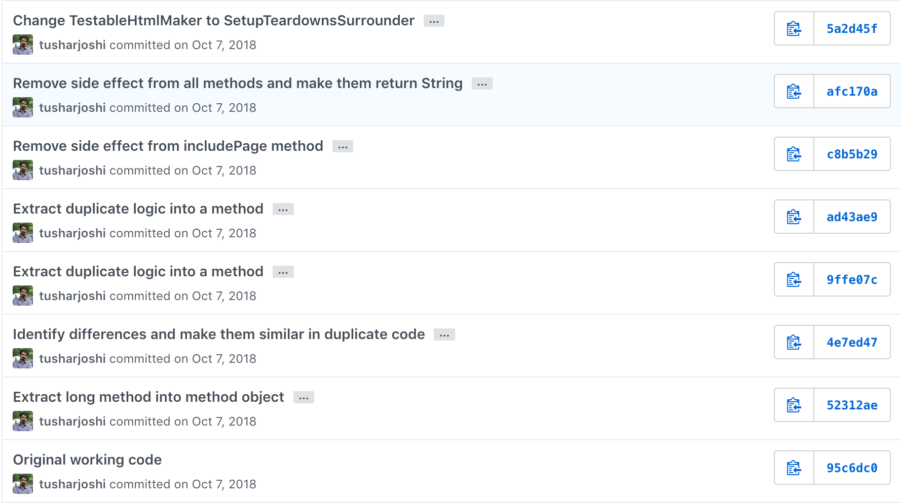

# Clean Code Kata - TestableHtml

Code used to demonstrate in a workshop how clean code principles can be
applied to existing legacy code.

Activity

- select the whole code of testableHtml method
- Extract into Method Object name it TestableHtmlMaker
- Move TestableHtmlMaker class to top level
- Make the local variables fields
- make wikiPage field, shift init in constructor
- make buffer a field, shift init in constructor

Observe

- three lines of code repeating pattern
- the code is different in some parts
- direct extract method is not possible

Activity

- Extract wikiPage.getPageCrawler() into field crawler, init in constructor
- test should pass
- Select setup word in the string and use Extract Variable, replace all 2 occurences
- name the variable mode
- Select teardown word in the string and use Extract Variable, replace all 2 occurences
- name the variable mode

Activity

- select the three lines which are duplicate
- Extract method
- name WikiPage variable just page
- Replace all occurrences when asked

Activity

- Change string concatenation in includePage
- Use String.format to create the string instead of concatenation
- test should pass

Observe

- Duplicate logic for inherited page inclusion
- the logic includes page only if it exists that is non null

Activity

- Shift the line String mode = "teardown"; to make duplicate lines same
- Extract the first literal parameter SuiteResponder.SUITE_SETUP_NAME to a variable named pageName
- Select the three duplicate lines 
- extract method with name includeIfInherited
- replace all occurrences
- restore the SuiteResponder.SUITE_SETUP_NAME parameter directly remove variable

Activity

- Rename the WikiPage variable in includeIfInherited method to page
- return the string from includePage method instead of buffer.append
- add the buffer.append to includeIfInherited method instead

Activity

- select mode variable and use inline refactoring to remove it
- remove both move variables
- select the code in first if and name it includeSetups
- select the code in second if and name it includeTeardowns
- Change buffer field to String and rename to content
- Remove side effects from all methods for content by appending strings

Activity

- Change logic of pageData.hasAttribute("Test") condition
- Make two conditionals combine by taking out page content twice
- extract condition to method isTestPage
- extract the if condition isTestPage into method surroundPageWithSetupsAndTeardowns
- Rename class TestableHtmlMaker to SetupTeardownSurrounder
- rename invoke method to surround

## Code changes from commits

The commits of this repository are maintained according to the Activity lists mentioned above and follow one or two activities per commit.  They can be used to check what code was changed for those activities.

